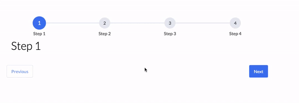

# Welcome to react-stepz 👋

This is a fork of a fork of react-step-progress. Thanks to r-bt for the work.
I wanted to be able to render children components with props and the original repo broke some of my functionality through the way in which it parsed html through the context.


> Hook based Multi step and dynamic progress indicator for react. Built using typescript, hooks and lots-o'-☕ and lots-o'-❤️ .
> Uses CSS modules so you don't have to worry about your CSS class names clashing with ours



## Install

```
npm install [this repository directly]
```

## Usage

> **NOTE:** I'm working towards an implementation where you don't have to import the stylesheet explicitly. I feel like that's not an ideal solution. Feel free to help me out 😁

```javascript
import React from 'react';

import { useStepProgress, StepProgress, StepProgressBar, Step } from 'react-step-progress';
import 'react-step-progress/dist/index.css';

import './index.css';
import './App.css';

const step1Content = <h1>Step 1</h1>;
const step2Content = <h1>Step 2</h1>;
const step3Content = <h1>Step 3</h1>;
const step4Content = <h1>Step 4</h1>;

function step2Validator() {
  return true;
}

function step3Validator() {
  return false;
}

function App() {

  const steps = [
    {
      label: 'Step 1',
      name: 'step 1',
    },
    {
      label: 'Step 2',
      name: 'step 2',
      validator: step2Validator
    },
    {
      label: 'Step 3',
      name: 'step 3',
      validator: step3Validator,
    },
    {
      label: 'Step 4',
      name: 'step 4',
    }
  ];

  const { stepForward, stepBackwards, getProps, currentIndex } = useStepProgress({
    steps,
    startingStep: 0,
  });

  return (
    <div className="app">
      <StepProgress {...getProps} >
        <StepProgressBar />
        <Step step={1}>
          <h1>Hello there</h1>
        </Step>
        <Step step={2}>
          <h1>Next part</h1>
        </Step>
        <Step step={3}>
          <h1>Almost there</h1>
        </Step>
        <Step step={4}>
          <h1>Last step</h1>
        </Step>
      </StepProgress>
      <div className="step-buttons">
        <a
          className={`
            step-action-btn
            action-btn-secondary
            ${currentIndex === 0 && 'disabled'}
          `}
          onClick={() => stepBackwards()}>
          Previous
        </a>
        <a
          className={`
            step-action-btn
            action-btn-primary
            ${currentIndex === steps.length - 1 && 'disabled'}
          `}
          onClick={() => stepForward()}>
          Next
        </a>
      </div>
    </div>
  );
}

export default App;
```

## Available Props

* startingStep (`number`) - the index of the step at which to start
* steps (`ProgressStep[]`) - array of steps with each step containing a label, name and content
* wrapperClass (`string`) - CSS class name for progress wrapper element
* progressClass (`string`) - CSS class name for progress bar element
* stepClass (`string`) - CSS class name for step indicator
* contentClass (`string`) - CSS class name for step content element
* buttonWrapperClass (`string`) - CSS class name for action buttons wrapper element
* primaryBtnClass (`string`) - CSS class name for primary themed button
* secondaryBtnClass (`string`) - CSS class name for secondary themed button

## Show your support

Give a ⭐️ if this project helped you!

## CONTRIBUTING & CODE OF CONDUCT

See [CODE_OF_CONDUCT.md](CODE_OF_CONDUCT.md)
